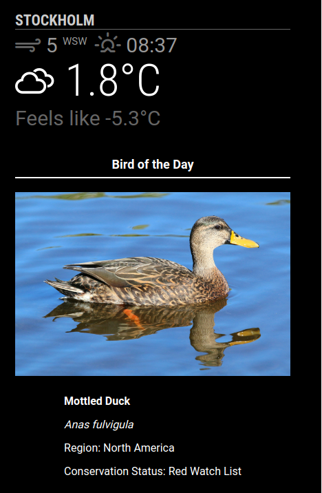
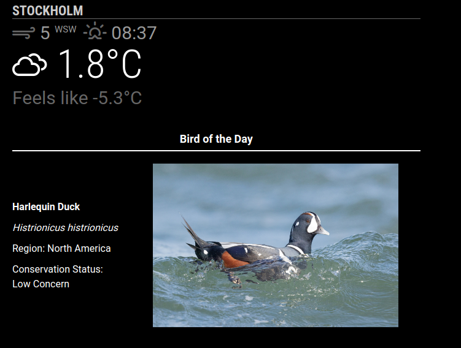
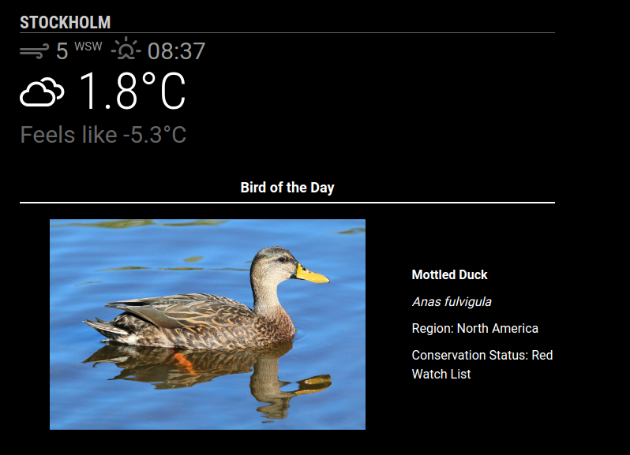

<div align="center">

# 🐦 MMM-BirdOfTheDay

[](https://github.com/cgillinger/MMM-BirdOfTheDay/releases)
[](LICENSE)
[](https://magicmirror.builders/)
[](https://nuthatch.lastelm.software/)
[](https://github.com/cgillinger/MMM-BirdOfTheDay/issues)

A **MagicMirror²** module that displays a beautifully rendered Bird of the Day — complete with image, common name, scientific name, region, and conservation status.

*Powered by the [Nuthatch API](https://nuthatch.lastelm.software/) by Last Elm Software.*

</div>

---

## 📋 Table of Contents

- [Screenshots](#-screenshots)
- [Features](#-features)
- [Prerequisites](#-prerequisites)
- [Installation](#-installation)
- [Configuration](#-configuration)
- [Layout Options](#-layout-options)
- [Customization](#-customization)
- [Credits](#-credits)
- [License](#-license)

---

## 📸 Screenshots

<div align="center">

| Text Below *(Default)* | Text on Left | Text on Right |
|:---:|:---:|:---:|
|  |  |  |

</div>

---

## ✨ Features

- 🖼️ Displays a random bird with a high-quality image
- 🔄 Configurable rotation — **Hourly**, **Daily**, or **Weekly**
- 📋 Optional details: common name, scientific name, region, and conservation status
- 📐 Flexible layout: text **below**, **left**, or **right** of the image
- 🎨 Fully customizable image size and font size via CSS
- 🧠 Smart history tracking to avoid showing the same bird twice
- 🏷️ Configurable module title based on rotation interval

---

## 🔧 Prerequisites

- [MagicMirror²](https://magicmirror.builders/) installed and running
- A **free** API key from the [Nuthatch API](https://nuthatch.lastelm.software/getKey.html)

---

## 📦 Installation

**1.** Navigate to your MagicMirror's `modules` directory:

```bash
cd ~/MagicMirror/modules
```

**2.** Clone this repository:

```bash
git clone https://github.com/cgillinger/MMM-BirdOfTheDay
```

---

## ⚙️ Configuration

**Step 1 — Get your free API key:**

Visit the [Nuthatch API key generation page](https://nuthatch.lastelm.software/getKey.html) and follow the instructions.

**Step 2 — Add the module to your `config.js`:**

```javascript
{
    module: "MMM-BirdOfTheDay",
    position: "top_center",     // Choose your preferred position
    config: {
        apiKey: "YOUR_API_KEY_HERE",   // Required
        rotation: "Daily",             // "Hourly" | "Daily" | "Weekly"
        imageWidth: "400px",           // CSS width value
        fontSize: "medium",            // "small" | "medium" | "large"
        textPosition: "below",         // "below" | "left" | "right"
        showTitleLine: true,
        maxHistory: 50,
        showName: true,
        showSciName: true,
        showRegion: true,
        showStatus: true,
    },
},
```

### Configuration Options

| Option | Type | Default | Required | Description |
|--------|------|---------|:--------:|-------------|
| `apiKey` | `string` | —  | ✅ **Yes** | Your Nuthatch API key |
| `rotation` | `string` | `"Daily"` | No | Update frequency: `"Hourly"`, `"Daily"`, or `"Weekly"` |
| `imageWidth` | `string` | `"400px"` | No | Width of the bird image (any CSS value) |
| `fontSize` | `string` | `"medium"` | No | Font size for text: `"small"`, `"medium"`, or `"large"` |
| `textPosition` | `string` | `"below"` | No | Text position relative to image: `"below"`, `"left"`, or `"right"` |
| `showTitleLine` | `boolean` | `true` | No | Show a horizontal line beneath the module title |
| `maxHistory` | `number` | `50` | No | How many birds to remember before allowing repeats |
| `showName` | `boolean` | `true` | No | Display the bird's common name |
| `showSciName` | `boolean` | `true` | No | Display the bird's scientific name *(in italics)* |
| `showRegion` | `boolean` | `true` | No | Display the bird's region(s) |
| `showStatus` | `boolean` | `true` | No | Display the bird's conservation status |

---

## 📐 Layout Options

Control where the text appears relative to the image using the `textPosition` option:

<details>
<summary><strong>⬇️ Text Below (Default)</strong></summary>

```javascript
config: {
    textPosition: "below",
}
```

</details>

<details>
<summary><strong>⬅️ Text on Left</strong></summary>

```javascript
config: {
    textPosition: "left",
}
```

</details>

<details>
<summary><strong>➡️ Text on Right</strong></summary>

```javascript
config: {
    textPosition: "right",
}
```

</details>

---

## 🎨 Customization

You can further tweak the appearance by editing `MMM-BirdOfTheDay.css` in the module folder. Adjust colors, fonts, spacing, and more to match your mirror's theme.

---

## 🙏 Credits

Bird data and images are provided by the [**Nuthatch API**](https://nuthatch.lastelm.software/) by **Last Elm Software** — a big thanks for making this free resource available! All rights for bird data and images belong to their respective contributors.

---

## 📄 License

This project is licensed under the **MIT License** — see the [LICENSE](LICENSE) file for details.

---

<div align="center">

Made with ❤️ for birdwatchers and smart mirror enthusiasts

</div>
