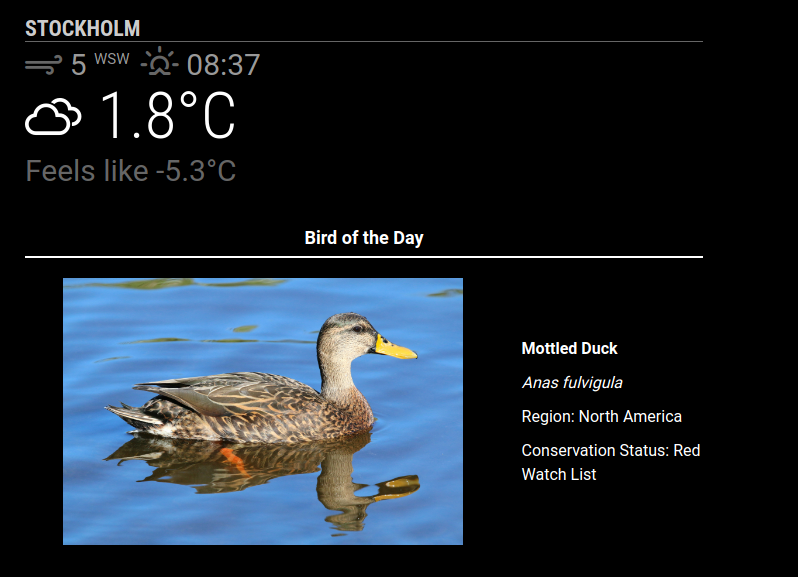

# MMM-BirdOfTheDay

A MagicMirror² module to display a random bird with an image and optional information such as its name, region, scientific name, and conservation status. Powered by the **Nuthatch API** by Last Elm Software.

## Layout Options

### Text Below Image (Default)


### Text on Left


### Text on Right


## Features
- Displays a random bird with an image
- Configurable rotation: **Hourly**, **Daily**, or **Weekly**
- Optional details: Name, scientific name, region, and conservation status
- Flexible layout options: text below, left, or right of image
- Customizable styles for images and text
- Smart history tracking to prevent duplicate birds
- Configurable title formatting

## Powered By
**Bird of the Day** uses the [Nuthatch API by Last Elm Software](https://nuthatch.lastelm.software/). A big thanks to them for providing this free resource! 🌟

## Installation
1. Navigate to your MagicMirror's `modules` directory:
   ```bash
   cd ~/MagicMirror/modules
   ```
2. Clone this repository:
   ```bash
   git clone https://github.com/cgillinger/MMM-BirdOfTheDay
   ```

## Configuration
1. **Get Your Free API Key**:
   - Visit [Nuthatch API's key generation page](https://nuthatch.lastelm.software/getKey.html)
   - Follow the instructions to generate your free API key

2. **Add the Module to `config.js`**:
   Edit your `MagicMirror/config/config.js` file and add the following configuration:
   ```javascript
   {
       module: "MMM-BirdOfTheDay",
       position: "top_center", // Choose your preferred position
       config: {
           apiKey: "YOUR_API_KEY_HERE", // Replace with your Nuthatch API key
           rotation: "Daily", // Options: "Hourly", "Daily", "Weekly"
           imageWidth: "400px", // Customize the image size
           fontSize: "medium", // Font size for text
           textPosition: "below", // Options: "below", "left", "right"
           showTitleLine: true, // Show/hide line under title
           maxHistory: 50, // Number of birds to track before repeating
           showName: true, // Display the bird's common name
           showSciName: true, // Show the scientific name
           showRegion: true, // Display the region(s)
           showStatus: true, // Show conservation status
       },
   },
   ```

## Configuration Options

| **Option**       | **Description**                                        | **Default**   | **Required** |
|-----------------|--------------------------------------------------------|---------------|--------------|
| `apiKey`        | The API key for the Nuthatch API                        | `null`        | **Yes**      |
| `rotation`      | How often to update (`Hourly`, `Daily`, `Weekly`)       | `"Daily"`     | No           |
| `imageWidth`    | Width of the bird image                                 | `"400px"`     | No           |
| `fontSize`      | Font size for the text (`small`, `medium`, `large`)     | `"medium"`    | No           |
| `textPosition`  | Position of text relative to image                      | `"below"`     | No           |
| `showTitleLine` | Show horizontal line under the title                    | `true`        | No           |
| `maxHistory`    | Number of birds to track before allowing repeats        | `50`          | No           |
| `showName`      | Whether to display the bird's common name               | `true`        | No           |
| `showSciName`   | Whether to display the bird's scientific name           | `true`        | No           |
| `showRegion`    | Whether to display the region(s)                        | `true`        | No           |
| `showStatus`    | Whether to display the conservation status              | `true`        | No           |

## Layout Examples

### Text Below (Default)
```javascript
{
    config: {
        textPosition: "below",
        // ... other config options
    }
}
```

### Text on Left
```javascript
{
    config: {
        textPosition: "left",
        // ... other config options
    }
}
```

### Text on Right
```javascript
{
    config: {
        textPosition: "right",
        // ... other config options
    }
}
```

## Customization
You can further customize the styles by editing the `MMM-BirdOfTheDay.css` file, located in the module's folder.

## License
This project is licensed under the MIT License.

---

### Credits
This module uses the [Nuthatch API](https://nuthatch.lastelm.software/) by Last Elm Software to fetch bird data. All rights for the bird data and images belong to the respective contributors.

---

Happy birdwatching! 🐦